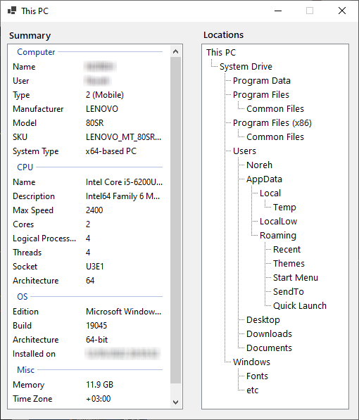

# This PC

I do a lot of modifications in Windows, so I constantly visit this and that folder. Doing these visits manually is tedious. That's why I thought about creating a small tool that maps these commonly visited locations.

Double clicking an item in the list opens the location in the Explorer.

